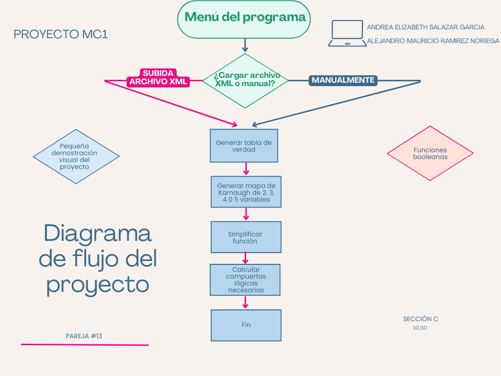
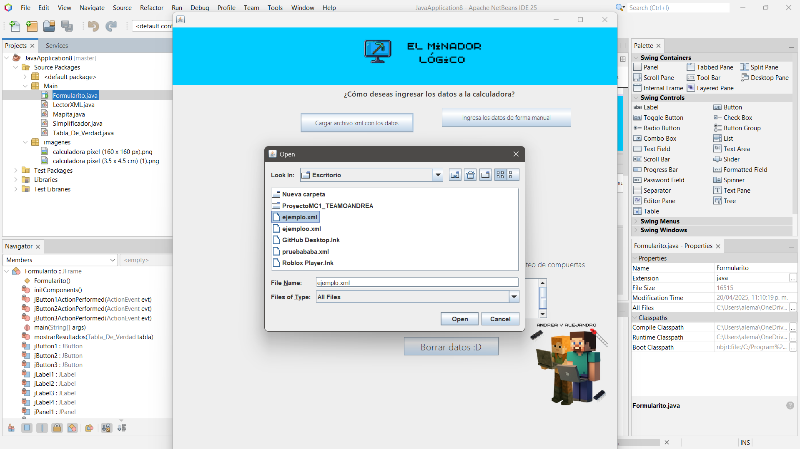
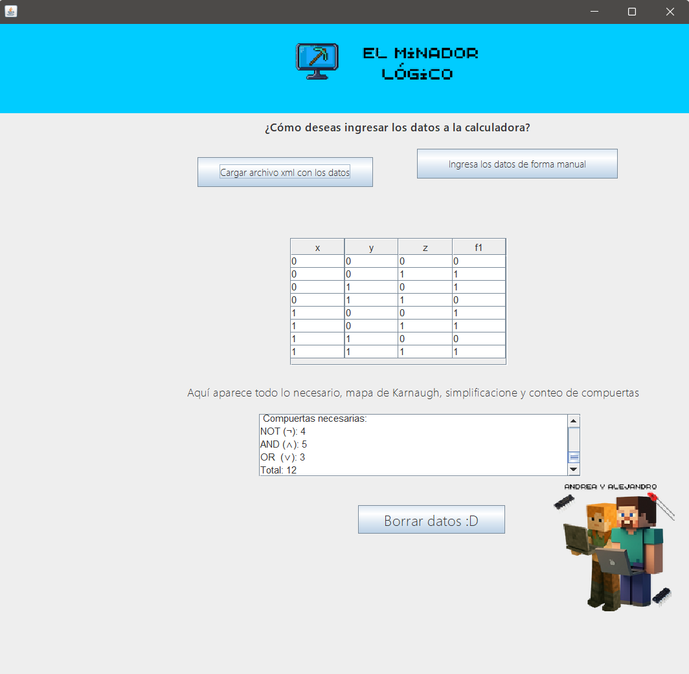
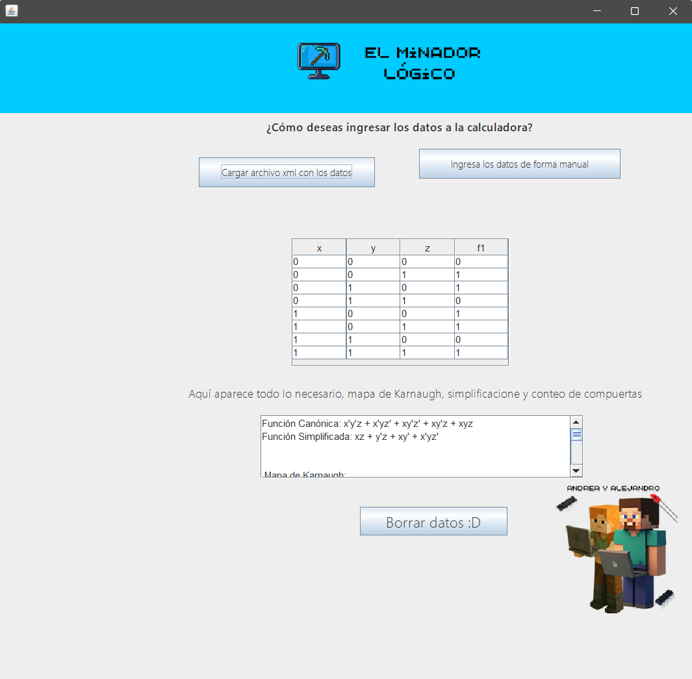

# 🧠🐢 Informe sobre el Proyecto de Mapas de Karnaugh 🤓🐒

## 📄 Carátula
- **Curso:** Matematica para computación 1
- **Sección:** C
- **Junior muy junior #1:** Andrea Elizabeth Salazar García
- **Junior muy junior #2:** Alejandro Mauricio Ramírez Noriega
- **Pareja #13**

---

## 📚 Índice
1. [Introducción](#1-introducción)
2. [Objetivos](#2-objetivos)
3. [Marco Teórico](#3-marco-teórico)
4. [Descripción del Problema](#4-descripción-del-problema)
5. [Propuesta Lograda](#5-propuesta-lograda)
   - [Algoritmo](#algoritmo)
   - [Diagrama de Flujo](#diagrama-de-flujo)
   - [Pseudocódigo](#pseudocódigo)
   - [Implementación del Algoritmo](#implementación-del-algoritmo)
6. [Mockups del Software](#6-mockups-del-software)
7. [Conclusiones](#7-conclusiones)
8. [Referencias](#8-referencias)

---

## 1. 🚪 Introducción 🧵
Este proyecto tiene como fin el facilitar la lectura de funciones booleanas mediante un programa visual e interactivo (con sus limitantes claro) desde archivos XML, esta herramienta crea su respectivo mapa de Karnaugh y simplifica las funciones dadas para poder llevarlas a la implementación de circuitos electrónicos digitales. Este es un trabajo de aprendizaje.

---

## 2. 🎯 Objetivos ✅

### Objetivo General:
- El desarrollo de una herramienta que sea capaz de leer funciones booleanas mediante un archivo XML, al igual que sea capaz de hacer su respectivo mapa de Karnaugh, con su función simplificada así ser capaz de llevar a cabo la implementación en un circuito.

### Objetivos Específicos:
- Poner en uso los conocimientos obtenidos en el curso sobre álgebra booleana.
- Familiarización si no se contaba con el entorno de GitHub, el uso de NetBeans y el lenguaje de Java.
- Lectura de archivos en formato XML que contengan funciones booleanas.
- Implementación de interfaz gráfica con Swing.
- Automatización de mapas de Karnaugh de 3, 4 y 5 variables para su visualización.
- Generar función booleana canónica y su simplificación.
- Dar una estimación del número de compuertas lógicas necesarias para su implementación en un circuito.

---

## 3. 🤔 Marco Teórico 📚

### 🔲 Funciones booleanas 📎

Una función booleana es una expresión lógica compuesta por variables que solo pueden tener dos valores posibles, ya sea 0 (o F) siendo falso o 1 (o V) siendo verdadera. Estas funciones se construyen utilizando operadores lógicos como **Y (∧)**, **O (∨)** y **NO (¬)**. Estas son la base fundamental de los circuitos.

---

### 🗺️ Mapas de Karnaugh 🗺️

El mapa de karnaugh es una manera de simplificar funciones booleanas de una manera más sencilla, ya que se hace de manera visual agrupando valores que tienen la mismas salidas, así pudiendo eliminar redundancias logicas.

---

### 📦 Archivos XML 📦

Los archivos xml sirven en especial en estos proyectos, ya que permiten almacenar datos estructurados que a la hora de subirlo al programa coloca las instrucciones dadas, digase los valores en este caso que serían nombres de las variables y sus valores de entrada y salida.

---

### 🧱 Compuertas Lógicas 📲
De estas están compuestos los cricuitos digitales, las compuertas logicas tienen asignada una operación simple, que las más usadas son:
Son los bloques básicos de todo circuito digital. Cada compuerta realiza una operación lógica simple:

- **AND:** Salida 1 solo si ambas entradas son 1.
- **OR:** Salida 1 si al menos una entrada es 1.
- **NOT:** Invierte el valor (0 a 1, 1 a 0).

Al tener ya simplificados el numero de compuertas logicas necesarias, se puede utilizar para hacer una estimación para llevar a fisico el circuito.

---

## 4. 🛠️ Descripción del Problema ☭
Para realizar un circuito digital a fisico se realiza mediante el álgebra booleana, por eso mismo ha tomado mucho más peso en estos tiempos. Debido a eso surge la necesidad de poder simplificar ese proceso, ya que hacerlo a mano llega a ser muy tedioso en muchos casos. Se ha desarrollado un programa capaz de hacerlo realidad.

Este programa podrá realizar:

- Poder leer un archivo tipo xml, en el cual esté la información de una tabla de verdad.
- Con esa información poder crear su mapa de karnaugh.
- Sacar su función booleana que se hace canon de golpe y su versión simplificada.
- Con todo lo anterior poder calcular la cantidad de compuertas logicas necesarias para llevarlo a fisico.
Todo siempre en una interfaz minecraftera intuitiva que sea agradable y facil de usar, desarrollada en java swing.

---

## 5. 🤖 Propuesta Lograda 👀

### 🔧 Algoritmo 💻
Para poder cumplir con todos los requisitos, el programa debe seguir cierto orden logico:

1. Enseñarle al usuario una interfaz minecraftera amigable.
2. Preguntarle al usuario si desea subir un archivo xml o ingresar los datos manualmente.
4. Si se elije subir el archivo xml:
   - Mostrar ventana de selección de archivo.
   Si se elige subir los datos manual:
   - Enseñar el espacio para subir los datos.
  
5. En base a los datos cargados, general el mapa de karnaugh
6. Calcular su función booleana bien canon sobre los valores dados.
7. Poder simplificar la función.
8. Calcular el numero de compuertas logicas necesarias.
9. 
---

### 📊 Diagrama de Flujo 📊



---

### 📄 Pseudocódigo 🥸
```pseudocode
Inicio

  Mostrar interfaz gráfica

  Preguntar al usuario si desea subir archivo xml o ingresar manualmente

  Si la opción es xml:
    Abrir selector de archivos
    Validar que el archivo sea correcto
    Leer datos del xml
  Si no:
    Pedir datos manualmente

  Generar tabla de verdad
  Generar mapa de karnaugh
  Simplificar función booleana
  Calcular compuertas necesarias
  Mostrar resultados

Fin
```

---

### 💻 Implementación del Algoritmo

El siguiente fragmento muestra la parte del código que permite al usuario seleccionar un archivo XML desde la interfaz, procesarlo y mostrar los resultados en la tabla y el área de texto:

```java
private void jButton1ActionPerformed(java.awt.event.ActionEvent evt) {
    JFileChooser fileChooser = new JFileChooser();
    int result = fileChooser.showOpenDialog(this);

    if (result == JFileChooser.APPROVE_OPTION) {
        File archivoSeleccionado = fileChooser.getSelectedFile();

        if (archivoSeleccionado != null && archivoSeleccionado.exists()) {
            String ruta = archivoSeleccionado.getAbsolutePath();
            tabla = new Tabla_De_Verdad();

            try {
                if (LectorXML.cargarDesdeXML(ruta, tabla)) {
                    mostrarResultados(tabla);
                } else {
                    JOptionPane.showMessageDialog(this, "Error al cargar el archivo XML.");
                }
            } catch (Exception e) {
                JOptionPane.showMessageDialog(this, "Error al procesar el archivo:\n" + e.getMessage());
                e.printStackTrace();
            }
        } else {
            JOptionPane.showMessageDialog(this, "Archivo no válido o no encontrado.");
        }
    }
}
```
---

## 6. 🖼️ Mockups del Software 🧵

### 🗂️ Carga de archivo XML desde la interfaz 🗂️



### 📋 Visualización de la Tabla de Verdad 📋



### 👁️‍🗨️ Función booleana generada 👁️‍🗨️



### 🗺️ Mapa de Karnaugh generado 🗺️


### 🔌 Estimación de compuertas lógicas necesarias 🔌


---

## 7. 🐢 Conclusiones 🐒

- La creación de este programa es una muy buena manera de poner en uso los conocimientos adquiridos en el curso y aprender literal a programar y familiarizarce con el entorno de Github y netbeans.
- Automatizar esto para el tema de circuitos es una muy buena manera de poder centrarse en cosas más avanzadas.
- Es un reto bastante grande pero lo vale.

---

## 8. 📚 Referencias 🥸

- [Curso de Java Netbeans completo – YouTube (Canal: Daniel Carreón)](https://youtu.be/18UA7X2ss8g?si=z-V_-fvx6MIJxYGI)
- Ayuda y material utilizado en el curso y uedi de MC1.
- [Lista de reproducción sobre Karnaugh y Álgebra Booleana – YouTube (profesor Yisus)](https://www.youtube.com/playlist?list=PLAzlSdU-KYwWtfcYGSWCKD9Hf1nuhBdrQ)

---

## 📽️ Video 📹
https://www.canva.com/design/DAGlPXCzp10/YUxa2QeoUaw0_3V6anDwDQ/watch?utm_content=DAGlPXCzp10&utm_campaign=designshare&utm_medium=link2&utm_source=uniquelinks&utlId=h8fda5a537c

